# Diagrama de Casos de Uso

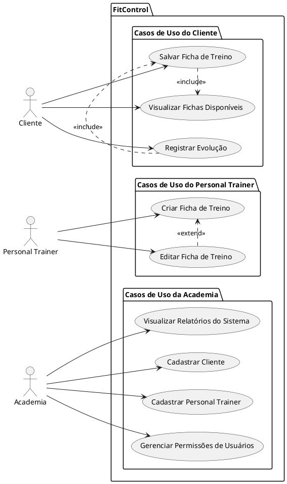

---

# Diagrama de Componentes e Implantação

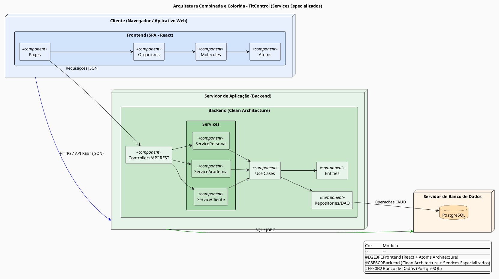

---

# Diagrama de Classe 

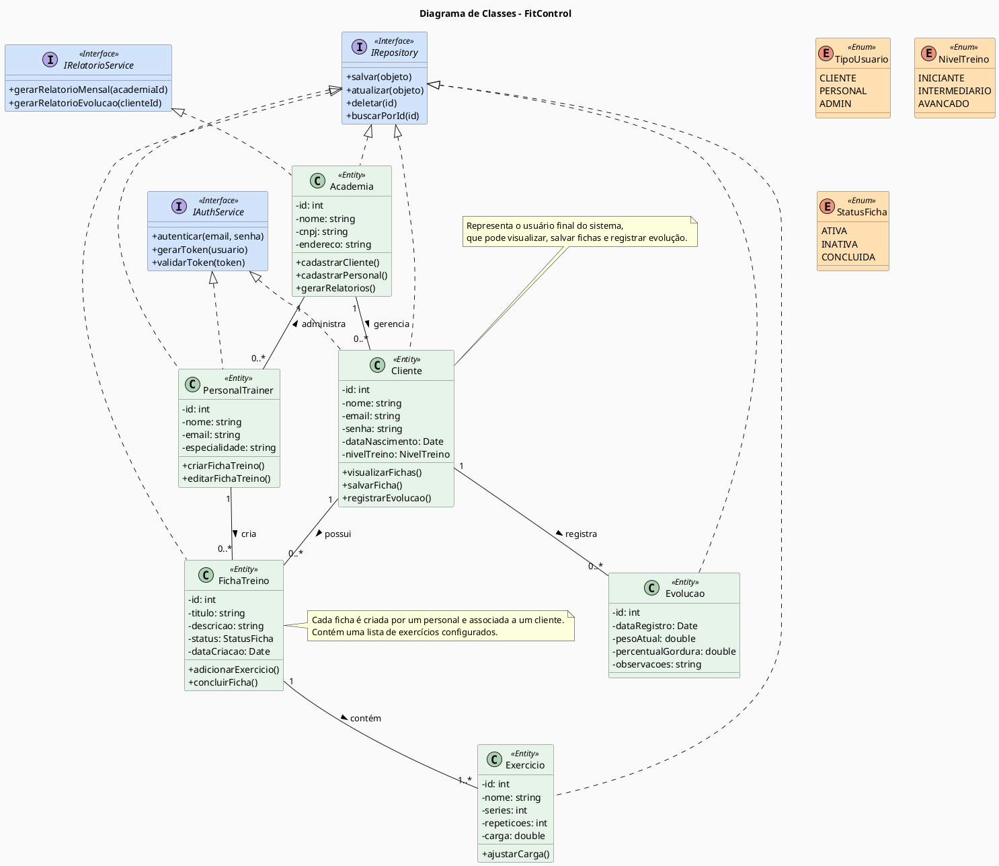

---

# Diagrama de Sequência

## Diagrama de Sequência – Criar Ficha de Treino

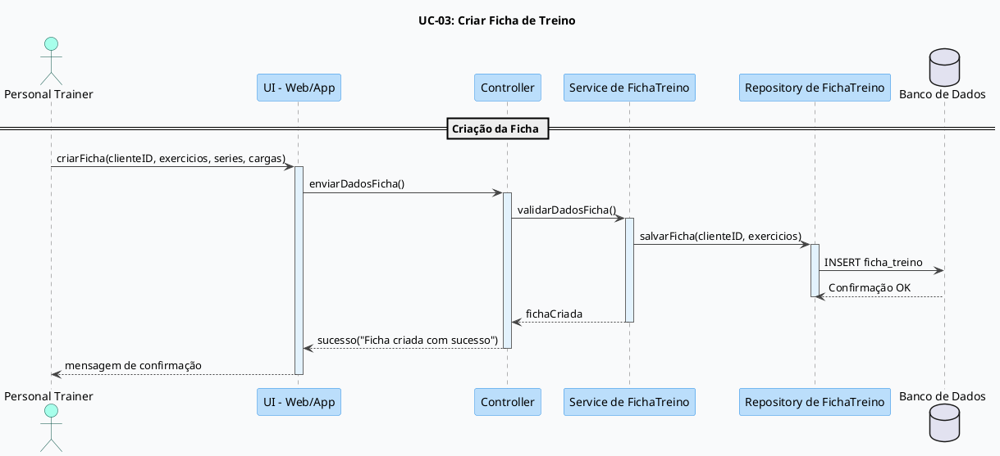

##Diagrama de Sequência – Salvar Ficha de Treino

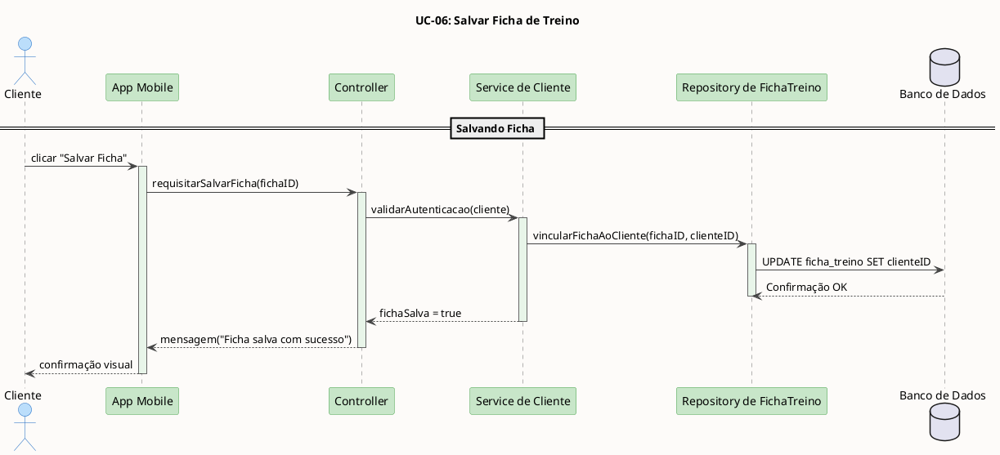

## Diagrama de Sequência – Registrar Evolução

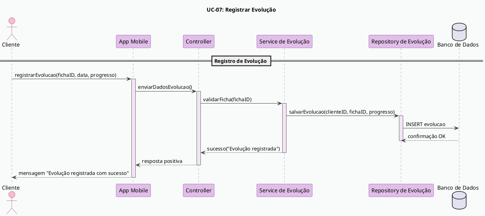

---

# Diagrama de Sequência

## Diagrama de Sequência Criar Ficha de Treino

```plantuml
@startuml
title UC-03 - Criar Ficha de Treino (Diagrama de Comunicação)
skinparam backgroundColor #FAFAFA
skinparam componentStyle rectangle
skinparam object {
    BackgroundColor<<Ator>> #A7FFEB
    BackgroundColor<<Interface>> #BBDEFB
    BackgroundColor<<Service>> #C8E6C9
    BackgroundColor<<Repository>> #FFE0B2
    BackgroundColor<<Database>> #F3E5F5
    BorderColor #555555
}

' === Objetos (clientes e fornecedores) ===
object "PersonalTrainer\n(cliente)" as PT <<Ator>>
object "UI - Web/App\n(cliente/fornecedor)" as UI <<Interface>>
object "Controller\n(cliente/fornecedor)" as Ctrl <<Interface>>
object "ServiceFichaTreino\n(cliente/fornecedor)" as Svc <<Service>>
object "RepoFichaTreino\n(fornecedor)" as Repo <<Repository>>
object "Banco de Dados\n(fornecedor)" as DB <<Database>>

' === Layout vertical compacto ===
PT -down- UI
UI -down- Ctrl
Ctrl -down- Svc
Svc -down- Repo
Repo -down- DB

' === Links (relações) ===
PT -- UI : vínculo
UI -- Ctrl : vínculo
Ctrl -- Svc : vínculo
Svc -- Repo : vínculo
Repo -- DB : vínculo

' === Mensagens numeradas ===
PT -> UI : 1: criarFicha(clienteID, exercicios, series, cargas)
UI -> Ctrl : 1.1: enviarDadosFicha()
Ctrl -> Svc : 1.2: validarDadosFicha()
Svc -> Repo : 1.3: salvarFicha(clienteID, exercicios)
Repo -> DB : 1.3.1: INSERT ficha_treino
DB --> Repo : 1.3.2: confirmação OK
Repo --> Svc : 1.4: retorno fichaCriada
Svc --> Ctrl : 1.5: sucesso("Ficha criada")
Ctrl --> UI : 1.6: resposta("OK")
UI --> PT : 1.7: mensagem de confirmação
@enduml
```

## Diagrama de Sequência Salvar Ficha de Treino

```plantuml
@startuml
title UC-06 - Salvar Ficha de Treino (Diagrama de Comunicação)
skinparam backgroundColor #FEFEFC
skinparam componentStyle rectangle
skinparam object {
    BackgroundColor<<Ator>> #BBDEFB
    BackgroundColor<<Interface>> #C8E6C9
    BackgroundColor<<Service>> #FFF59D
    BackgroundColor<<Repository>> #FFCC80
    BackgroundColor<<Database>> #E1BEE7
    BorderColor #444444
}

' === Objetos ===
object "Cliente\n(cliente)" as Cliente <<Ator>>
object "App Mobile\n(cliente/fornecedor)" as UI <<Interface>>
object "Controller\n(cliente/fornecedor)" as Ctrl <<Interface>>
object "ServiceCliente\n(cliente/fornecedor)" as Svc <<Service>>
object "RepoFichaTreino\n(fornecedor)" as Repo <<Repository>>
object "Banco de Dados\n(fornecedor)" as DB <<Database>>

' === Layout vertical ===
Cliente -down- UI
UI -down- Ctrl
Ctrl -down- Svc
Svc -down- Repo
Repo -down- DB

' === Links ===
Cliente -- UI
UI -- Ctrl
Ctrl -- Svc
Svc -- Repo
Repo -- DB

' === Mensagens numeradas ===
Cliente -> UI : 1: clicarSalvarFicha(fichaID)
UI -> Ctrl : 1.1: requisitarSalvarFicha()
Ctrl -> Svc : 1.2: validarAutenticacao(cliente)
Svc -> Repo : 1.3: vincularFichaAoCliente(fichaID, clienteID)
Repo -> DB : 1.3.1: UPDATE ficha_treino SET clienteID
DB --> Repo : 1.3.2: confirmação OK
Repo --> Svc : 1.4: fichaSalva = true
Svc --> Ctrl : 1.5: respostaSucesso()
Ctrl --> UI : 1.6: mensagem("Ficha salva com sucesso")
UI --> Cliente : 1.7: exibirConfirmação()
@enduml
```

## Diagrama de Sequencia Registrar Evolução

```plantuml
@startuml
title UC-07 - Registrar Evolução (Layout Vertical)
skinparam backgroundColor #F8FBF9
skinparam componentStyle rectangle
skinparam object {
  BorderColor #555
  BackgroundColor<<Ator>> #F8BBD0
  BackgroundColor<<Interface>> #E1BEE7
  BackgroundColor<<Service>> #C5E1A5
  BackgroundColor<<Repository>> #FFF59D
  BackgroundColor<<Database>> #D7CCC8
}

' === Objetos ===
object "Cliente\n<<Ator>>" as Cliente
object "App Mobile\n<<Interface>>" as UI
object "Controller\n<<Interface>>" as Ctrl
object "ServiceEvolucao\n<<Service>>" as Svc
object "RepoEvolucao\n<<Repository>>" as Repo
object "Banco de Dados\n<<Database>>" as DB

' === Layout vertical ===
Cliente -down-> UI
UI -down-> Ctrl
Ctrl -down-> Svc
Svc -down-> Repo
Repo -down-> DB

' === Mensagens numeradas ===
Cliente -> UI : 1: registrarEvolucao(fichaID, data, progresso)
UI -> Ctrl : 1.1: enviarDadosEvolucao()
Ctrl -> Svc : 1.2: validarFicha(fichaID)
Svc -> Repo : 1.3: salvarEvolucao(clienteID, fichaID, progresso)
Repo -> DB : 1.3.1: INSERT evolucao
DB --> Repo : 1.3.2: confirmação OK
Repo --> Svc : 1.4: retorno sucesso
Svc --> Ctrl : 1.5: mensagem("Evolução registrada")
Ctrl --> UI : 1.6: resposta OK
UI --> Cliente : 1.7: exibirMensagem("Registro concluído")
@enduml
```

---

## Diagrama de Estados

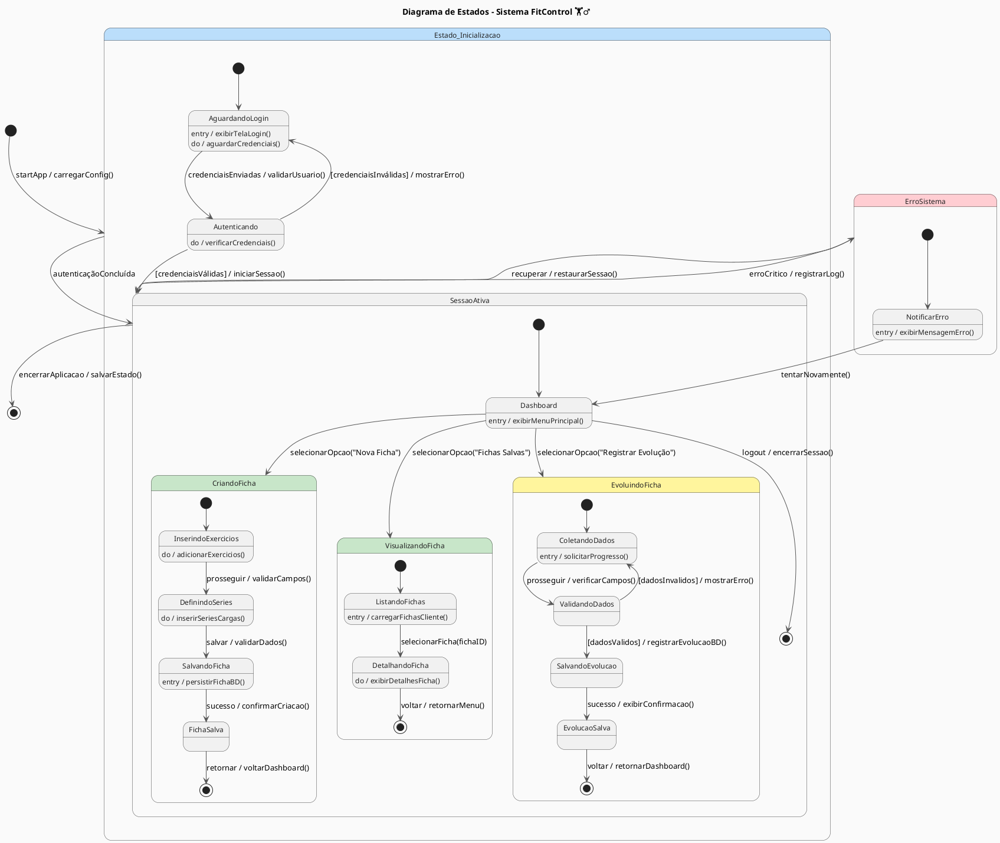

---

# Modelo de Entidade Relacional 

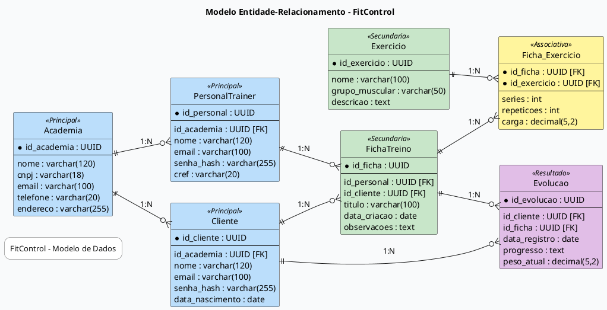

